# কীভাবে ব্লুটুথ ট্র্যাকার শনাক্ত করবেন

*সর্বশেষ পর্যালোচনা: ১৫ জুলাই, ২০২৪*

> **লাইসেন্স ও অ্যাট্রিবিউশন নোট**
> এই লেখাটি Electronic Frontier Foundation (EFF)-এর Surveillance Self-Defense (SSD) প্রকল্পের "How to: Detect Bluetooth Trackers" নিবন্ধের একটি বাংলা অনুবাদ। মূল নিবন্ধ: <https://ssd.eff.org/module/how-to-detect-bluetooth-trackers>
> মূল লেখাটি [Creative Commons Attribution 4.0 International (CC BY 4.0)](https://creativecommons.org/licenses/by/4.0/) লাইসেন্সের অধীনে প্রকাশিত। এই অনুবাদও একই লাইসেন্সের অধীনে প্রকাশিত।
> অনুবাদ করা হয়েছে মূল ইংরেজি লেখা থেকে; এতে পরিবর্তন (ভাষান্তর) করা হয়েছে। এই অনুবাদ EFF কর্তৃক অনুমোদিত বা সমর্থিত নয়।
> অনুবাদক: সামিন ইয়াসার · অনুবাদের তারিখ: ০১ অক্টোবর, ২০২৬

---

২০২৪ সালের ১৩ মে [অ্যাপল](https://www.apple.com/newsroom/2024/05/apple-and-google-deliver-support-for-unwanted-tracking-alerts-in-ios-and-android/) ও [গুগল](https://security.googleblog.com/2024/05/google-and-apple-deliver-support-for.html) উভয়েই ঘোষণা করে যে তারা কিছু থার্ড-পার্টি (তৃতীয় পক্ষের) ট্র্যাকারের জন্য ক্রস-প্ল্যাটফর্ম, অপারেটিং সিস্টেম-স্তরের নোটিফিকেশন সমর্থন করা শুরু করবে, যা AirTag শনাক্তকরণ সতর্কবার্তার মতোই কাজ করবে। তত্ত্বগতভাবে এর মানে হলো, আপনার ফোন কোনো থার্ড-পার্টি অ্যাপ ছাড়াই কিছু ব্লুটুথ ট্র্যাকার শনাক্ত করতে পারবে। তবে আমাদের পরীক্ষায় দেখা গেছে, এই নতুন মডেলগুলো সবসময় শনাক্ত হয় না। তাই আপাতত যেসব ট্র্যাকার অপারেটিং সিস্টেম সমর্থন করে না, সেগুলো খুঁজে বের করতে আমরা এখনও AirGuard ব্যবহারের পরামর্শ দিই। অ্যাপল ও গুগলের অপারেটিং সিস্টেম-স্তরের বৈধ নোটিফিকেশন দেখতে এমন হয়: "(ডিভাইসের নাম) আপনার কাছাকাছি শনাক্ত হয়েছে" অথবা "আপনার সঙ্গে অজানা আইটেম শনাক্ত হয়েছে।" নিচের AirTag-সংক্রান্ত অংশগুলোতে যেভাবে বলা হয়েছে, ঠিক সেভাবেই আপনি ফোনের পর্দায় দেখানো নির্দেশনা অনুসরণ করতে পারেন।

## সূচিপত্র

- [ব্লুটুথ ট্র্যাকার কী?](#ব্লুটুথ-ট্র্যাকার-কী)
  - [প্রচলিত ব্লুটুথ ট্র্যাকার দেখতে কেমন](#প্রচলিত-ব্লুটুথ-ট্র্যাকার-দেখতে-কেমন)
- [আপনার ফোন স্বয়ংক্রিয়ভাবে ট্র্যাকার খুঁজে পেলে কেমন দেখায়](#আপনার-ফোন-স্বয়ংক্রিয়ভাবে-ট্র্যাকার-খুঁজে-পেলে-কেমন-দেখায়)
  - [অ্যান্ড্রয়েড ডিভাইসে](#অ্যান্ড্রয়েড-ডিভাইসে)
  - [আইফোনে](#আইফোনে)
- [কীভাবে ম্যানুয়ালি ব্লুটুথ ট্র্যাকার খুঁজবেন](#কীভাবে-ম্যানুয়ালি-ব্লুটুথ-ট্র্যাকার-খুঁজবেন)
  - [অ্যান্ড্রয়েড ডিভাইসে ম্যানুয়াল অনুসন্ধান](#অ্যান্ড্রয়েড-ডিভাইসে-ম্যানুয়াল-অনুসন্ধান)
  - [আইফোনে ম্যানুয়াল অনুসন্ধান](#আইফোনে-ম্যানুয়াল-অনুসন্ধান)
- [অজানা ট্র্যাকার পেলে কী করবেন](#অজানা-ট্র্যাকার-পেলে-কী-করবেন)

---

AirTag, Tile এবং Samsung SmartTag-এর মতো ব্লুটুথ লোকেশন ট্র্যাকারগুলো বাজারজাত করা হয় লাগেজ বা হারিয়ে যাওয়া মানিব্যাগ খুঁজে পাওয়ার উপায় হিসেবে। কিন্তু এগুলো অনায়াসে গোপনে কারও ব্যাগ বা গাড়িতে রেখে দেওয়া যায়, ফলে স্টকার (পিছু নেওয়া ব্যক্তি) ও নির্যাতনকারীরা সংশ্লিষ্ট ব্যক্তির অজান্তেই তাঁর অবস্থান সম্পর্কে নজিরবিহীন তথ্য পেয়ে যেতে পারে। এই ডিভাইসগুলো এত ছোট যে মানিব্যাগ বা চাবির রিংয়ের ভেতরেও ঢুকে যায়। বিশেষত কী খুঁজছেন তা না জানলে এগুলো খুঁজে পাওয়া কঠিন।

আপনার যদি অ্যান্ড্রয়েড ডিভাইস বা আইফোন থাকে, তাহলে আপনার শরীরে, ব্যাগে বা গাড়িতে রাখা ব্লুটুথ লোকেশন ট্র্যাকার আপনি খুঁজে দেখতে পারেন। কোনো ট্র্যাকার আপনার সঙ্গে চলাচল করছে বলে শনাক্ত করলে আপনার ফোন আপনাকে সতর্কবার্তাও পাঠাতে পারে। তবে সতর্কবার্তা আসার সময় ভিন্ন ভিন্ন হতে পারে, এবং কেবল [নির্দিষ্ট কিছু ব্র্যান্ডের ব্লুটুথ ট্র্যাকারের নোটিফিকেশন](https://www.eff.org/deeplinks/2023/05/victory-apple-and-google-collaborate-detecting-unwanted-location-trackers) আপনি পেতে পারেন।

এই গাইডে বিস্তারিত বলা হবে আপনার ফোন নিজে থেকে কী শনাক্ত করতে পারে এবং কোন ট্র্যাকারগুলো শনাক্ত করতে থার্ড-পার্টি অ্যাপ লাগবে। মনে রাখবেন, শনাক্তকরণ অ্যাপের নির্ভরযোগ্যতা নিখুঁত নয়, তাই সম্পূর্ণভাবে এগুলোর ওপর নির্ভর করা উচিত নয়।

## ব্লুটুথ ট্র্যাকার কী?

ব্লুটুথ ট্র্যাকার হলো ব্যাটারিচালিত ছোট ডিভাইস, যা ব্যক্তিগত সম্পদ ট্র্যাক করার জন্য তৈরি। এগুলো অন্য ডিভাইসের (সাধারণত ফোনের) সঙ্গে যোগাযোগ করতে ব্লুটুথ ব্যবহার করে এবং সেই ফোনের মোবাইল নেটওয়ার্ক বা ওয়াই-ফাই সংযোগের সাহায্যে ট্র্যাকারের মালিকের কাছে নিজেদের অবস্থান পাঠায়। এই ট্র্যাকারগুলোর নির্ভরযোগ্যতা ও নির্ভুলতা নির্ভর করে তারা কোন নেটওয়ার্কের সঙ্গে যুক্ত তার ওপর। উদাহরণস্বরূপ, ব্লুটুথের সীমার (প্রায় ৩০ ফুট বা প্রায় ৯ মিটার) মধ্যে থাকা প্রতিটি আইফোনের মাধ্যমে Apple AirTag তথ্য পাঠাতে পারে, ফলে বেশিরভাগ শহর ও জনপদে এগুলো খুবই নির্ভুল হয়। অন্যান্য ব্র্যান্ডও একইভাবে কাজ করে, তবে নিজেদের নেটওয়ার্কের মাধ্যমে। ব্লুটুথ ট্র্যাকারে জিপিএস (GPS) থাকে না, তাই এগুলো জিপিএসের মতো নির্ভুল নয়। ব্লুটুথ ট্র্যাকার ব্যবহার করতে হলে মালিককে ট্র্যাকারটি একটি অ্যাকাউন্টে নিবন্ধন করতে হয়, এবং সাধারণত সেই অ্যাকাউন্ট নাম, ইউজারনেম বা ফোন নম্বরের কোনো না কোনো সমন্বয়ের সঙ্গে ট্র্যাকারটিকে যুক্ত করে।

বেশিরভাগ ব্লুটুথ ট্র্যাকারেই মালিক ট্র্যাকারের অবস্থান অন্যদের সঙ্গে "শেয়ার" করতে পারেন। উদাহরণস্বরূপ, একজন AirTag-এর মালিক তার অবস্থান [আরও তিনজন পর্যন্ত মানুষের সঙ্গে শেয়ার করতে পারেন](https://support.apple.com/guide/iphone/share-airtag-item-find-iphone-iph419cc5f28/ios)। Life360-এর Tile-এর ব্যবহারকারীরা [সীমাহীন সংখ্যক মানুষের সঙ্গে শেয়ার করতে পারেন](https://support.thetileapp.com/hc/en-us/articles/205332837-Sharing-a-Tile)। কোনো AirTag যদি আপনার সঙ্গে বা আপনার সঙ্গে থাকা কারও সঙ্গে শেয়ার করা হয়ে থাকে, তাহলে আপনি "অজানা ট্র্যাকার" সতর্কবার্তা পাবেন না। এছাড়া, মালিককে খুঁজে বের করতে আপনি যদি কোনো AirTag স্ক্যান করেন, তাহলেও সেটি যে অন্য কারও সঙ্গে শেয়ার করা হচ্ছে তা দেখানো হবে না।

এটি এভাবে কাজ করে: ধরুন আপনি আপনার সাইকেলে একটি ব্লুটুথ ট্র্যাকার লাগিয়েছেন এবং সাইকেলটি হারিয়ে গেল। ট্র্যাকারটি অবিরত কাছাকাছি থাকা ফোনগুলোকে নিজের অবস্থান জানাতে থাকবে। সেই ফোনগুলো যদি ওই ট্র্যাকারের সঙ্গে কাজ করার জন্য সেট করা থাকে (যেমন সব আইফোন ডিফল্টভাবে AirTag-এর সঙ্গে কাজ করে, অথবা Tile ট্র্যাকার যেমন অন্য Tile ব্যবহারকারীদের এবং Amazon-এর Sidewalk নেটওয়ার্কের সঙ্গে কাজ করে), তাহলে ফোনটি ট্র্যাকারের আনুমানিক অবস্থান প্রস্তুতকারক প্রতিষ্ঠানের কাছে পাঠিয়ে দেয়। এরপর ট্র্যাকারের মালিক হিসেবে আপনি সেই অবস্থান দেখতে পান। মালিকের দৃষ্টিকোণ থেকে বিষয়টি দেখতে অনেকটা এমন হবে:

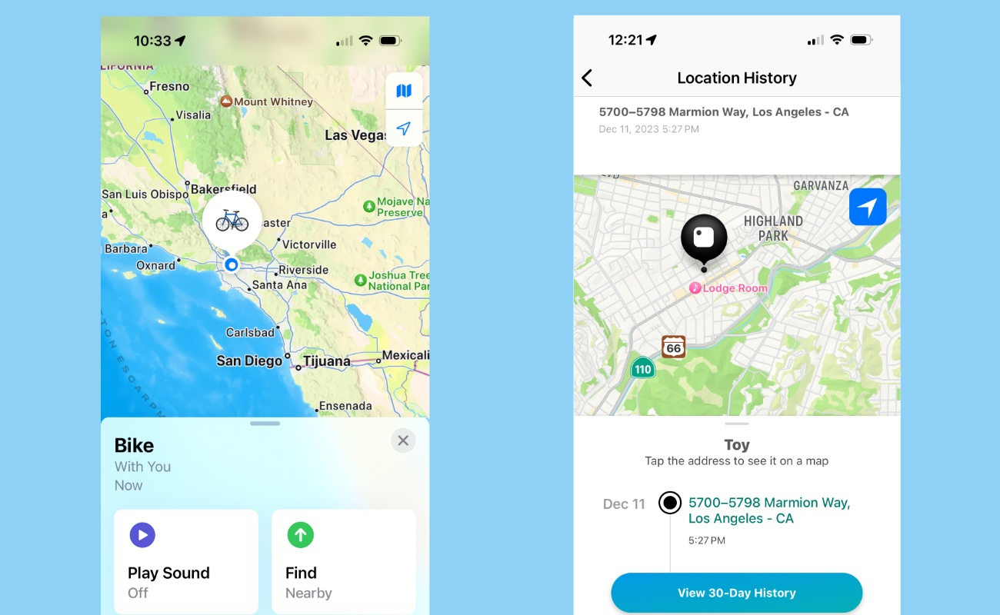
*বাঁ দিকে আইফোনের Apple Find My অ্যাপের স্ক্রিনশট, ডান দিকে আইফোনেই Tile অ্যাপের স্ক্রিনশট।*

ডিভাইস নির্মাতারা বারবার বলে থাকে যে এগুলো কেবল ব্যক্তিগত সম্পদ ট্র্যাক করার জন্য, কিন্তু কোনো মানুষের গায়ে এই ট্র্যাকার লাগিয়ে দেওয়া খুবই সহজ। স্টকিং ঠেকাতে কিছু ব্লুটুথ ট্র্যাকার মালিক নন এমন ব্যক্তিদের জন্য, ফোন অ্যাপের মাধ্যমে অথবা শব্দ করে, ট্র্যাকার কাছাকাছি থাকলে সেটি খুঁজে পাওয়ার ব্যবস্থা রাখে। এই অ্যাপগুলো কীভাবে কাজ করে এবং কোথায় করে না, তা নিচে আলোচনা করব। তার আগে জেনে নেওয়া ভালো, ঠিক কী খুঁজছেন।

### প্রচলিত ব্লুটুথ ট্র্যাকার দেখতে কেমন

Tile এবং Chipolo-র মতো কিছু ব্র্যান্ড একাধিক designs-এর ট্র্যাকার তৈরি করে। তাই প্রতিটি পণ্যের পাতা দেখে নেওয়া ভালো, যাতে কী খুঁজতে হবে তা আপনার জানা থাকে। সবচেয়ে জনপ্রিয় কয়েকটি ট্র্যাকার হলো:

- [Apple AirTag](https://www.apple.com/airtag/)
- [Life360 Tile](https://www.tile.com/products)
- [Samsung SmartTag](https://www.samsung.com/us/mobile/mobile-accessories/phones/?category_names=Phones&accessories_type=SmartThings)
- [Chipolo](https://chipolo.net/en/pages/chipolo-collection)

বর্তমানে কেবল Apple AirTag-ই এমন, যা মালিকের কাছে না থেকে আপনার সঙ্গে ভ্রমণ করতে থাকলে শব্দ করে আপনাকে সতর্ক করে। তবে সেটিও শব্দ করা শুরু করতে ২৪ ঘণ্টা পর্যন্ত সময় নিতে পারে। AirTag কী ধরনের শব্দ করে তা [এই ভিডিওতে](https://www.youtube.com/watch?v=c0TVHPHRjXg) দেখানো হয়েছে।

আপনার যদি স্মার্টফোন না থাকে, তাহলে কেউ আপনার গায়ে ট্র্যাকার লাগিয়েছে কি না, তার একমাত্র সূত্র সম্ভবত AirTag-এর বিপ বিপ শব্দ। তবে মনে রাখবেন, কেউ চাইলে ওই শব্দ বন্ধও করে দিতে পারে।

## আপনার ফোন স্বয়ংক্রিয়ভাবে ট্র্যাকার খুঁজে পেলে কেমন দেখায়

অ্যান্ড্রয়েড ও iOS উভয়ই স্বয়ংক্রিয়ভাবে শনাক্ত করতে পারে যে কোনো অজানা AirTag আপনার সঙ্গে ভ্রমণ করছে। এখানে "অজানা" মানে হলো, ট্র্যাকারটি অন্য কারও ফোনের সঙ্গে যুক্ত (পেয়ার করা), কিন্তু বর্তমানে সেই ফোনের সঙ্গে সংযুক্ত নেই। উদাহরণস্বরূপ, আপনার যে বন্ধুর চাবিতে AirTag লাগানো আছে, তার সঙ্গে থাকলে ওই ব্লুটুথ ট্র্যাকার নিয়ে আপনি কোনো নোটিফিকেশন পাবেন না। কিন্তু সেই বন্ধু যদি দিনের জন্য আপনাকে তার চাবি ধার দেন এবং আপনারা শারীরিকভাবে একসঙ্গে না থাকেন, তাহলে আপনি একটি "অজানা" ট্র্যাকারের নোটিফিকেশন পাবেন।

আপনার ফোন ট্র্যাকারটি সঙ্গে সঙ্গে শনাক্ত করবে না, এবং নোটিফিকেশন পেতে ২৪ ঘণ্টা পর্যন্ত সময় লাগতে পারে। অতিরিক্ত কোনো অ্যাপ ডাউনলোড না করে এই সুবিধা বর্তমানে কেবল AirTag-এর ক্ষেত্রেই কাজ করে, যদিও [অ্যান্ড্রয়েড ও অ্যাপল উভয়েই](https://www.eff.org/deeplinks/2023/08/industry-discussion-about-standards-bluetooth-enabled-physical-trackers-finally) Life360 ও Samsung-এর মতো অন্যান্য ব্লুটুথ ট্র্যাকার সমর্থন করার পরিকল্পনা ঘোষণা করেছে। অ্যাপলের "Find My" নেটওয়ার্ক ব্যবহার করে এমন অন্যান্য অ্যাপল ব্লুটুথ ডিভাইস, যেমন ওয়্যারলেস হেডফোনও, এই ধরনের সতর্কবার্তা ট্রিগার করতে পারে।

শনাক্তকরণ কাজ করার জন্য আপনার ফোনের কিছু সেবা চালু থাকতে হবে, যার মধ্যে রয়েছে ব্লুটুথ, কিছু লোকেশন সার্ভিস এবং নোটিফিকেশন। ফোন প্রথমবার সেট আপ করার সময় এগুলোর বেশিরভাগই ডিফল্টভাবে চালু থাকে, তবে আপনার নিরাপত্তা পরিকল্পনা অনুযায়ী আপনি হয়তো এগুলো বন্ধ করে রেখেছেন। এগুলো চালু আছে কি না তা [অ্যান্ড্রয়েড](https://support.google.com/android/answer/13658562?hl=en#zippy=%2Candroid-location-settings-privacy) ও [আইফোনে](https://support.apple.com/en-us/HT212227) কীভাবে দেখবেন, তার নির্দেশনা দেওয়া আছে।

যদি অজানা ট্র্যাকারের নোটিফিকেশন পান, তার অর্থ আপনার ফোন এমন একটি ব্লুটুথ ট্র্যাকার শনাক্ত করেছে যা আপনার সঙ্গে চলছে। আতঙ্কিত হওয়ার আগে মনে রাখুন, বৈধভাবে ব্যবহৃত ট্র্যাকারের ক্ষেত্রেও এ ধরনের নোটিফিকেশন আসতে পারে, যেমন উপরের উদাহরণে বন্ধু আপনাকে AirTag লাগানো চাবি ধার দিয়েছেন।

কিন্তু অজানা ট্র্যাকারের নোটিফিকেশনের আরেকটি অর্থ হতে পারে, কেউ আপনার অজান্তে আপনার গায়ে বা আপনার কোনো জিনিসে ব্লুটুথ ট্র্যাকার লাগিয়ে দিয়েছে। এই নোটিফিকেশনগুলো দেখতে কেমন, এবং এমন নোটিফিকেশন পেলে কী করবেন, তা জানা গুরুত্বপূর্ণ।

নোটিফিকেশন পেলে এমন যেকোনো জায়গায় খুঁজে দেখুন যেখানে মার্কিন কোয়ার্টার (বা ১ ইউরো কয়েন) আকারের কোনো বস্তু লুকানো থাকতে পারে। এর মধ্যে রয়েছে যেকোনো পকেট, ব্যাগ বা জ্যাকেটের লাইনিং, এবং গাড়ির নিচের অংশ। আমরা সবচেয়ে বেশি শুনি ব্যাগের ভেতরে এবং গাড়িতে, এমনকি লাইসেন্স প্লেটের পেছনে এগুলো লুকানোর ঘটনা।

### অ্যান্ড্রয়েড ডিভাইসে

#### অ্যান্ড্রয়েড ১৪+-এ AirTag নোটিফিকেশন

আপনার ফোন যদি অ্যান্ড্রয়েড ১৪ বা তার নতুন সংস্করণ চালাতে পারে (আপনি কোন অপারেটিং সিস্টেম ব্যবহার করছেন তা দেখতে যান **Settings > About Phone > Android Version**), তাহলে অতিরিক্ত কোনো অ্যাপ ডাউনলোড ছাড়াই এটি AirTag শনাক্ত করতে পারবে (তবে অন্যান্য ব্লুটুথ ট্র্যাকার নয়)। এই সুবিধা ডিফল্টভাবে চালু থাকে, কিন্তু নিশ্চিত হতে চাইলে **Settings > Safety & emergency > Unknown tracker alerts** খুলে দেখুন "Allow alerts" চালু আছে কি না।

> এই সেটিংস আপনার অ্যান্ড্রয়েডের সংস্করণ ও ফোনের মডেল অনুযায়ী ভিন্ন হতে পারে। এই নির্দেশনা কাজ না করলে আপনার ফোন নির্মাতার ওয়েবসাইট দেখুন।

আপনার ফোন কোনো AirTag শনাক্ত করলে আপনি এরকম একটি নোটিফিকেশন পাবেন:

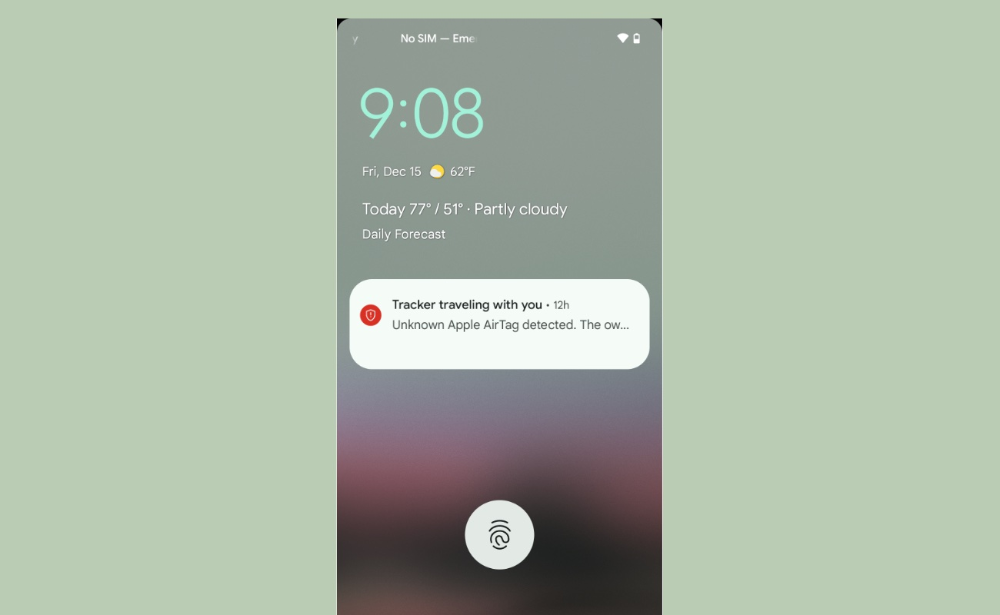
*অ্যান্ড্রয়েড ১৪-এ একটি অজানা AirTag-এর নোটিফিকেশন।*

নোটিফিকেশনে ট্যাপ করলে আপনি একটি মানচিত্র এবং তারিখ ও সময় দেখতে পাবেন, যা থেকে বোঝা যায় আপনার ফোন কখন আনুমানিকভাবে ট্র্যাকারটি লক্ষ করেছিল। মানচিত্র দেখানো হলেও তার অর্থ এই নয় যে AirTag-এর মালিক সেই সময় আপনার অবস্থান দেখছিলেন। AirTag-এর মালিক ট্র্যাকারের চলাচলের ইতিহাস দেখতে পান না। Apple ডিভাইসে "Find My" অ্যাপ খুললে তিনি কেবল বর্তমান অবস্থানই দেখতে পান। Tile ও Samsung SmartTag-এর মতো অন্যান্য ট্র্যাকারের ক্ষেত্রে বিষয়টি সবসময় এমন নয়, কারণ সেগুলো মালিককে চলাচলের ইতিহাস দেখার সুযোগ দিতে পারে (এগুলো কীভাবে শনাক্ত করবেন তা নিচে আলোচনা করা হবে)।

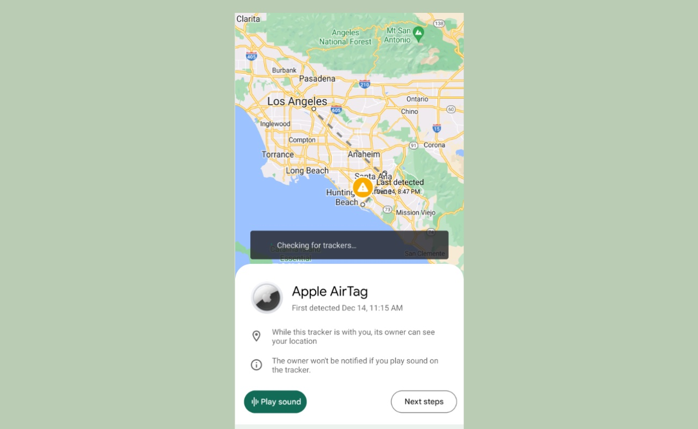
*অ্যান্ড্রয়েডের "Unknown AirTag" অনুসন্ধান স্ক্রিন।*

"Play sound"-এ ট্যাপ করলে AirTag-এর বিপ শব্দ শুরু হওয়ার কথা, যা সেটি খুঁজে পেতে সাহায্য করবে (তবে এটি সবসময় কাজ করে না। কাছাকাছি AirTag থাকলেও আপনি একটি ত্রুটির বার্তা পেতে পারেন, তাই এর ওপর নির্ভর করবেন না)। ট্র্যাকারটি খুঁজে পেলে AirTag-টি আপনার ফোনের পেছনে ধরুন। এতে এর সম্পর্কে আরও তথ্য পাবেন, যার মধ্যে রয়েছে নিবন্ধিত মালিকের ফোন নম্বরের শেষ চার সংখ্যা এবং সিরিয়াল নম্বর। আপনার কোনো সন্দেহ নিশ্চিত করতে, অথবা আইনশৃঙ্খলা রক্ষাকারী বাহিনীর সঙ্গে যোগাযোগ করার সিদ্ধান্ত নিলে, এই তথ্য কাজে লাগতে পারে। মনে রাখবেন, এটি একটি বার্নার ফোন (সাময়িক ব্যবহারের ফোন) বা দ্বিতীয় ফোন নম্বর হতে পারে। একইভাবে, কোনো AirTag-এর মালিক সেটির অবস্থান অন্যদের সঙ্গে শেয়ার করেছেন কি না, এই স্ক্রিনে তার কোনো ইঙ্গিত দেখানো হবে না। AirTag খুঁজে পাওয়ার পর নিচের [অজানা ট্র্যাকার পেলে কী করবেন](#অজানা-ট্র্যাকার-পেলে-কী-করবেন) অংশে যান।

*AirTag স্ক্যান করার পর মালিকের তথ্য দেখানো হচ্ছে, যার মধ্যে তাঁর অ্যাপল অ্যাকাউন্টে ব্যবহৃত ফোন নম্বরের শেষ চার সংখ্যা রয়েছে।*

#### AirGuard দিয়ে অন্যান্য অজানা ট্র্যাকারের নোটিফিকেশন

আপনার ফোনে অ্যান্ড্রয়েড ১৪-তে আপডেট করা না গেলে, অথবা শুধু AirTag নয় আরও বেশি ধরনের ট্র্যাকারের স্বয়ংক্রিয় শনাক্তকরণ চাইলে, আপনাকে একটি থার্ড-পার্টি অ্যাপ ব্যবহার করতে হবে। ট্র্যাকার খুঁজতে পারে এমন অনেক অ্যাপ আছে, তবে আমরা দেখেছি জনপ্রিয় ট্র্যাকারগুলোর বেশিরভাগ শনাক্ত করতে [AirGuard](https://github.com/seemoo-lab/AirGuard) কার্যকর। তবে এই গাইডের জন্য আমাদের পরীক্ষায় অ্যাপটি নিখুঁত ছিল না, এবং কয়েকবার অবাঞ্ছিত ট্র্যাকার শনাক্ত করতে প্রত্যাশার চেয়ে বেশি সময় নিয়েছে।

Google Play Store থেকে [AirGuard](https://play.google.com/store/apps/details?id=de.seemoo.at_tracking_detection.release) ডাউনলোড করে অ্যাপটি খুলুন। অ্যাপ কাজ করার জন্য প্রয়োজনীয় কয়েকটি অনুমতি দিতে বলা হবে: লোকেশন, কাছাকাছি ডিভাইস (nearby devices) এবং নোটিফিকেশন। লোকেশনের অনুমতি দেওয়া নিয়ে আপনি চিন্তিত হলে, জেনে রাখুন লোকেশন ছাড়াও অ্যাপটি কাজ করতে পারে, তবে তখন অ্যাপ ট্র্যাকারটি কোথায় খুঁজে পেয়েছিল তার অবস্থানের ইতিহাস থাকবে না। এখানে AirGuard-এর [প্রাইভেসি পলিসি](https://tpe.seemoo.tu-darmstadt.de/privacy-policy.html) দেওয়া আছে।

অনুমতিগুলো দেওয়া শেষ হলে আপনি অ্যাপের মূল স্ক্রিনে পৌঁছাবেন।

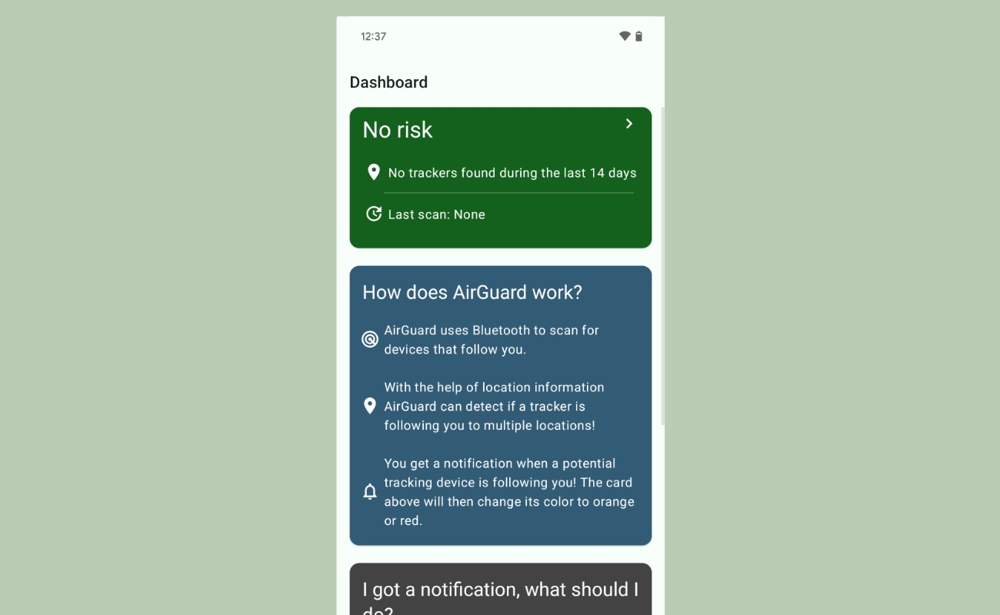
*অ্যান্ড্রয়েডে AirGuard-এর ড্যাশবোর্ড।*

প্রয়োজন অনুযায়ী AirGuard-এ অনেক সেটিংস পরিবর্তন করা যায়, তবে অ্যাপ কোনো অজানা ট্র্যাকারকে আপনার পিছু নিতে শনাক্ত করলে আপনাকে নোটিফিকেশন পাঠানোর জন্য ডিফল্ট সেটিংসই যথেষ্ট। AirGuard কোনো ট্র্যাকারকে আপনার পিছু নিতে শনাক্ত করলে আপনি এরকম একটি নোটিফিকেশন পাবেন।

নোটিফিকেশনে ট্যাপ করলে AirGuard খুলবে। আপনি লোকেশনের অনুমতি দিয়ে থাকলে একটি মানচিত্র দেখতে পাবেন, যেখানে আপনার ফোন প্রথমবার ট্র্যাকারটি কোথায় লক্ষ করেছিল তা দেখানো থাকবে, সঙ্গে পরবর্তী পদক্ষেপের জন্য কিছু বিকল্প থাকবে।

ট্র্যাকারটি যদি আপনার পরিচিত হয়, তাহলে সেটি নিয়ে আর নোটিফিকেশন পাওয়া বন্ধ করতে "Ignore Device"-এ ট্যাপ করতে পারেন। ব্লুটুথের স্বল্প পরিসরের কারণে সম্ভাবনা কম হলেও, ট্র্যাকারের ভুল শনাক্তকরণ ঘটতে পারে। আপনি যদি এমন কোথাও থাকেন যেখানে আপনার নিশ্চিত ধারণা কোনো ট্র্যাকার আপনার সঙ্গে নেই, তাহলে "False Alarm"-এ ট্যাপ করতে পারেন।

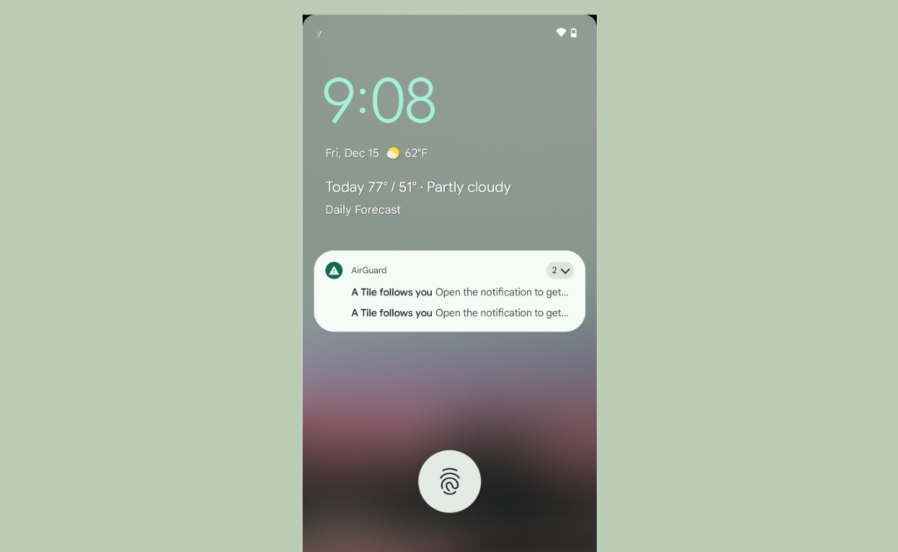
*অ্যান্ড্রয়েডে AirGuard-এর একটি নোটিফিকেশন।*

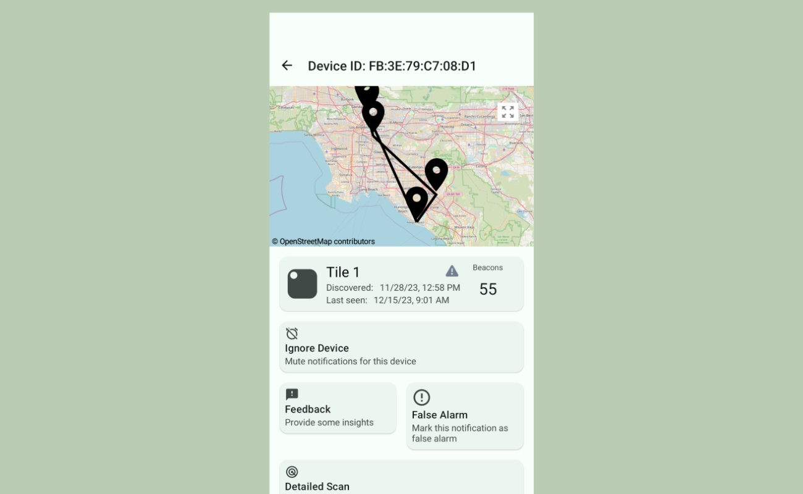
*অ্যান্ড্রয়েডে AirGuard-এর মানচিত্র স্ক্রিন।*

ব্লুটুথ ট্র্যাকারটি কোথায় লুকানো আছে তা এখনও খুঁজে না পেলে "Detailed Scan"-এ ট্যাপ করুন। এতে একটি শতকরা সংখ্যাসহ স্ক্রিন দেখাবে। সংখ্যাটি আপনার ফোন ও ট্র্যাকারের মধ্যে সংকেত কতটা শক্তিশালী তা নির্দেশ করে, এবং কাজ করে অনেকটা রাডারের মতো। ফোন হাতে নিয়ে হাঁটুন এবং দেখুন শতকরা হার বাড়ছে কি না। হার বাড়লে বুঝবেন আপনি ব্লুটুথ ট্র্যাকারের কাছাকাছি যাচ্ছেন। হার কমলে বুঝবেন সংকেত দুর্বল হচ্ছে, অর্থাৎ আপনি ভুল দিকে যাচ্ছেন।

সংখ্যাটি ৯০% বা তার বেশি হলে আপনি ট্র্যাকারের খুব কাছাকাছি আছেন। এটি খুঁজে পাওয়ার পর নিচের [অজানা ট্র্যাকার পেলে কী করবেন](#অজানা-ট্র্যাকার-পেলে-কী-করবেন) অংশে যান।

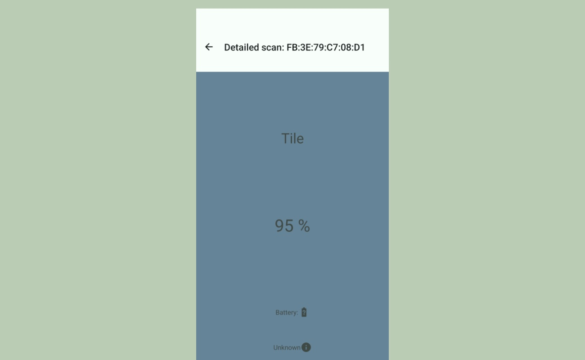
*অ্যান্ড্রয়েডে AirGuard-এর ট্র্যাকার অনুসন্ধান স্ক্রিন।*

### আইফোনে

#### iOS ১৪.৫+-এ AirTag নোটিফিকেশন

iOS ১৪.৫ বা তার নতুন সংস্করণ চালানো যেকোনো আইফোন স্বয়ংক্রিয়ভাবে আপনার পিছু নেওয়া অজানা AirTag শনাক্ত করবে এবং আপনাকে সতর্কবার্তা পাঠাবে (আপনি কোন অপারেটিং সিস্টেম সংস্করণ চালাচ্ছেন তা দেখতে **Settings > General > About > iOS Version** খুলুন)। এই সেটিং চালু আছে কি না তা নিশ্চিত করতে **Settings > Notifications > Tracking Notifications** খুলুন এবং "Allow Notifications" চালু আছে কি না দেখুন।

আপনার ফোন কোনো অজানা AirTag-কে আপনার সঙ্গে ভ্রমণ করতে শনাক্ত করলে নোটিফিকেশনটি দেখতে এমন হবে:

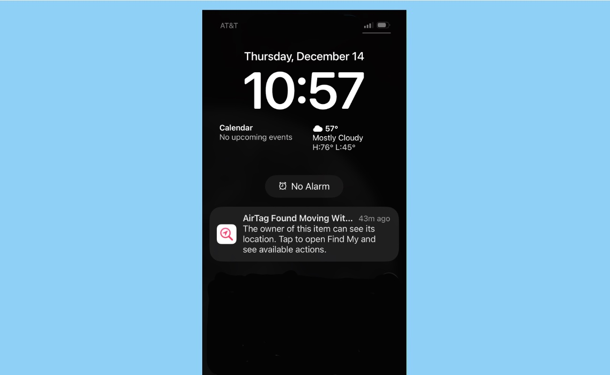
*আইফোনে অ্যাপলের অজানা AirTag-এর নোটিফিকেশন।*

নোটিফিকেশনে ট্যাপ করলে আপনার ফোন প্রথমবার AirTag-টি লক্ষ করার পর থেকে আপনি যেসব জায়গায় গিয়েছেন তার ইতিহাস দেখতে পাবেন। মানচিত্র দেখানো হলেও তার অর্থ এই নয় যে AirTag-এর মালিক সেই সময় আপনার অবস্থান দেখছিলেন। AirTag-এর মালিক ট্র্যাকারের চলাচলের ইতিহাস দেখতে পান না। "Find My" অ্যাপ খুললে তিনি কেবল বর্তমান অবস্থানই দেখতে পান। Tile ও Samsung SmartTag-এর মতো অন্যান্য ট্র্যাকারের ক্ষেত্রে বিষয়টি সবসময় এমন নয়, কারণ সেগুলো মালিককে চলাচলের ইতিহাস দেখার সুযোগ দিতে পারে (এগুলো কীভাবে শনাক্ত করবেন তা নিচে আলোচনা করা হবে)।

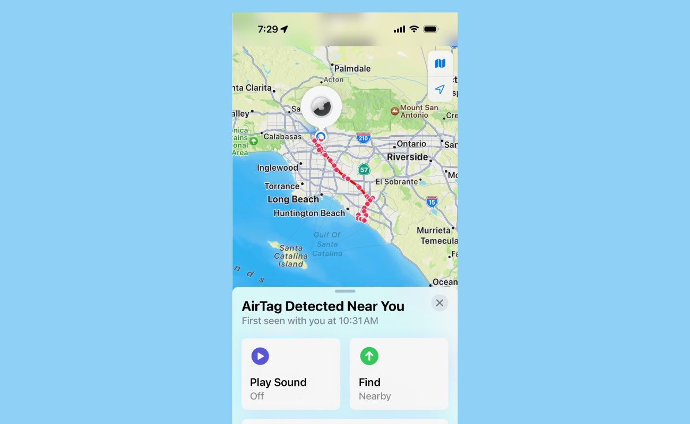
*আইফোনের "Find My" অ্যাপে একটি AirTag-এর ইতিহাস দেখানো হচ্ছে।*

AirTag-টি যদি আপনার পরিচিত হয়, যেমন উপরের উদাহরণে আপনি বন্ধুর চাবি ধার নিয়েছেন এবং তাতে AirTag লাগানো আছে, তাহলে ওই নির্দিষ্ট AirTag-এর নোটিফিকেশন বন্ধ করতে "Pause Tracking Notifications"-এ ট্যাপ করতে পারেন।

অন্যথায়, অজানা AirTag কোথায় আছে তা জানা না থাকলে সেটি খুঁজে পেতে আপনার কাছে কয়েকটি বিকল্প আছে। AirTag-কে বিপ শব্দ করাতে "Play Sound" অপশনে ট্যাপ করুন, যাতে সেটি খুঁজে পেতে সুবিধা হয়। তাতেও খুঁজে না পেলে "Find" অপশনে ট্যাপ করুন। আপনি যথেষ্ট কাছে থাকলে একটি স্ক্রিন দেখতে পাবেন যা তীরচিহ্নের মাধ্যমে আপনাকে AirTag-এর সঠিক অবস্থানের দিকে নিয়ে যাওয়ার চেষ্টা করে। সেটি খুঁজে পেতে পর্দার নির্দেশনা অনুসরণ করুন।

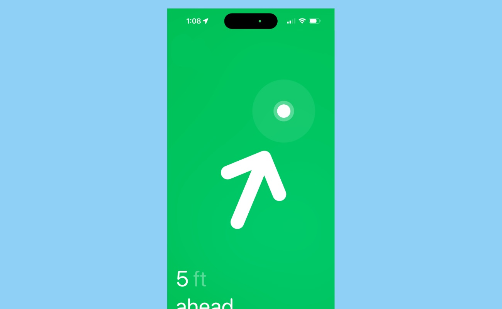
*আইফোনে অ্যাপলের AirTag খোঁজার স্ক্রিন।*

AirTag-টি খুঁজে পাওয়ার পর এবং সেটি আপনার অজানা তা নিশ্চিত হওয়ার পর নিচে স্ক্রল করে "Learn About This AirTag"-এ ট্যাপ করুন। এতে আপনার ওয়েব ব্রাউজার খুলবে এবং আপনাকে এমন একটি ওয়েবসাইটে নিয়ে যাবে যেখানে সিরিয়াল নম্বর এবং ওই AirTag-এ নিবন্ধিত ফোন নম্বরের শেষ চার সংখ্যা দেখানো হয়। আপনার কোনো সন্দেহ নিশ্চিত করতে, অথবা আইনশৃঙ্খলা রক্ষাকারী বাহিনীর সঙ্গে যোগাযোগ করার সিদ্ধান্ত নিলে, এই তথ্য কাজে লাগতে পারে। মনে রাখবেন, এটি একটি বার্নার ফোন বা দ্বিতীয় ফোন নম্বরের সঙ্গে যুক্ত হতে পারে। একইভাবে, কোনো AirTag-এর মালিক সেটির অবস্থান অন্যদের সঙ্গে শেয়ার করেছেন কি না, এই স্ক্রিনে তার কোনো ইঙ্গিত দেখানো হবে না। AirTag খুঁজে পাওয়ার পর নিচের [অজানা ট্র্যাকার পেলে কী করবেন](#অজানা-ট্র্যাকার-পেলে-কী-করবেন) অংশে যান।

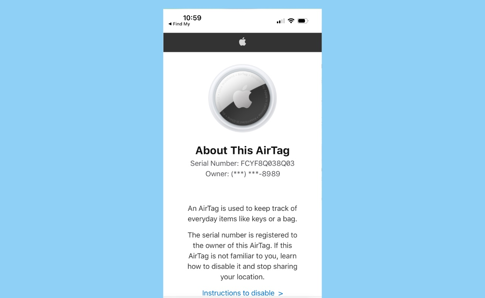
*AirTag স্ক্যান করার পর মালিকের তথ্য দেখানো হচ্ছে, যার মধ্যে তাঁর অ্যাপল অ্যাকাউন্টে ব্যবহৃত ফোন নম্বরের শেষ চার সংখ্যা রয়েছে।*

#### AirGuard দিয়ে অন্যান্য অজানা ট্র্যাকারের নোটিফিকেশন

শুধু AirTag নয়, আরও বেশি কিছু খুঁজতে চাইলে আপনার একটি থার্ড-পার্টি অ্যাপ লাগবে। ট্র্যাকার খুঁজতে পারে এমন অনেক অ্যাপ আছে, তবে আমরা দেখেছি বিভিন্ন ধরনের ট্র্যাকার শনাক্ত করতে [AirGuard](https://github.com/seemoo-lab/AirGuard-iOS) কার্যকর। তবে এই গাইডের জন্য আমাদের পরীক্ষায় অ্যাপটি নিখুঁত ছিল না, এবং কয়েকবার অবাঞ্ছিত ট্র্যাকার শনাক্ত করতে প্রত্যাশার চেয়ে বেশি সময় নিয়েছে।

Apple App Store থেকে [AirGuard](https://apps.apple.com/us/app/airguard-tracking-protection/id1659427454) অ্যাপটি ডাউনলোড করে খুলুন। অ্যাপ কাজ করার জন্য প্রয়োজনীয় কয়েকটি অনুমতি দিতে বলা হবে: লোকেশন, কাছাকাছি ডিভাইস এবং নোটিফিকেশন। লোকেশনের অনুমতি দেওয়া নিয়ে আপনি চিন্তিত হলে, জেনে রাখুন লোকেশন ছাড়াও অ্যাপটি কাজ করতে পারে, তবে তখন অ্যাপ ট্র্যাকারটি কোথায় খুঁজে পেয়েছিল তার অবস্থানের ইতিহাস থাকবে না। এখানে AirGuard-এর [প্রাইভেসি পলিসি](https://tpe.seemoo.tu-darmstadt.de/privacy-policy.html) দেওয়া আছে।

AirGuard কোনো ট্র্যাকার শনাক্ত করলে আপনি এরকম একটি নোটিফিকেশন পাবেন।

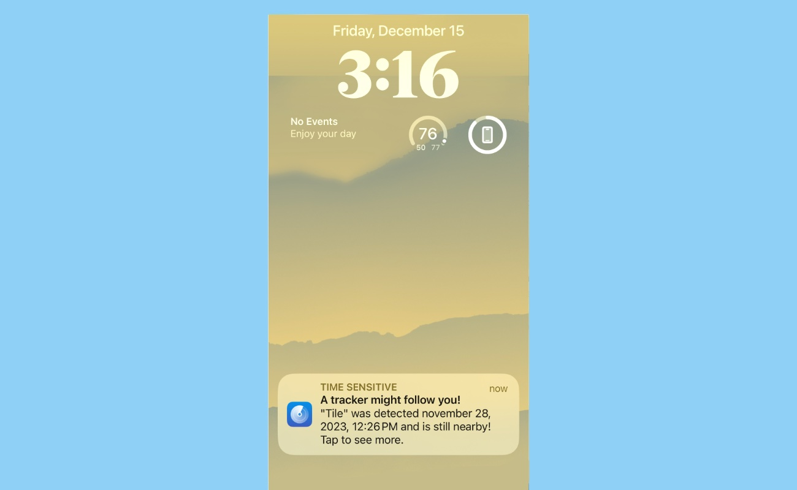
*আইফোনে AirGuard-এর একটি নোটিফিকেশনের উদাহরণ।*

নোটিফিকেশনে ট্যাপ করলে AirGuard এই স্ক্রিনে খুলবে, যেখানে একটি মানচিত্র এবং আপনার ফোন প্রথমবার ট্র্যাকারটি কোথায় লক্ষ করেছিল তার ইতিহাস দেখানো হবে।

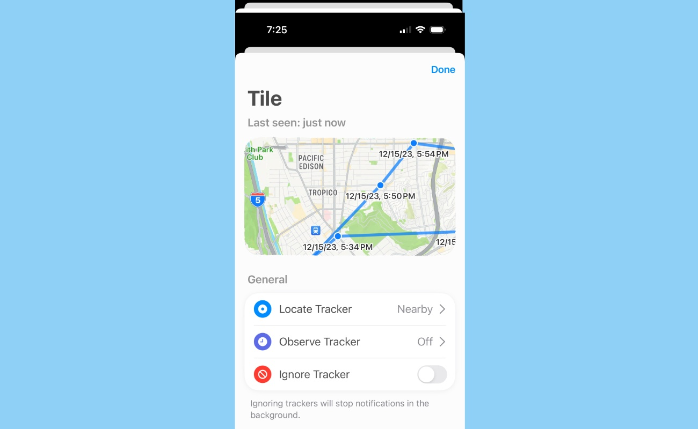
*আইফোনে AirGuard অ্যাপ, ট্র্যাকার শনাক্ত হওয়ার ইতিহাসের কিছু অংশ দেখাচ্ছে।*

এই স্ক্রিনে আপনার কাছে কয়েকটি বিকল্প আছে: "Locate Tracker" (যার কথা একটু পরেই বলব), "Observe Tracker" এবং "Ignore Tracker"। "Observe Tracker" অপশনে আপনি একটি টাইমার সেট করতে পারেন, যা এক ঘণ্টা পরেও ট্র্যাকারটি আপনার পিছু নিয়ে থাকলে আপনাকে আরেকটি নোটিফিকেশন পাঠাবে। এটি তখন কাজের, যখন এটি "অজানা" ট্র্যাকার কি না তা এখনও স্পষ্ট নয়। ব্লুটুথ ট্র্যাকারটি কী তা আপনার জানা থাকলে এবং সেটি নিয়ে আর নোটিফিকেশন না চাইলে "Ignore Tracker"-এ ট্যাপ করুন।

ট্র্যাকারটির মালিক কে বা সেটি কোথায় আছে তা জানা না থাকলে "Locate Tracker" অপশনে ট্যাপ করুন। এতে একটি শতকরা সংখ্যাসহ স্ক্রিন দেখাবে। সংখ্যাটি আপনার ফোন ও ট্র্যাকারের মধ্যে সংকেত কতটা শক্তিশালী তা নির্দেশ করে, এবং কাজ করে অনেকটা রাডারের মতো। ফোন হাতে নিয়ে হাঁটুন এবং দেখুন শতকরা হার বাড়ছে কি না। হার বাড়লে বুঝবেন আপনি কাছাকাছি যাচ্ছেন। হার কমলে বুঝবেন সংকেত দুর্বল হচ্ছে, অর্থাৎ আপনি ভুল দিকে যাচ্ছেন।

সংখ্যাটি ৯০% বা তার বেশি হলে আপনি ট্র্যাকারের খুব কাছাকাছি আছেন। এটি খুঁজে পাওয়ার পর নিচের [অজানা ট্র্যাকার পেলে কী করবেন](#অজানা-ট্র্যাকার-পেলে-কী-করবেন) অংশে যান।

*আইফোনের জন্য AirGuard-এর অনুসন্ধান সুবিধা।*

## কীভাবে ম্যানুয়ালি ব্লুটুথ ট্র্যাকার খুঁজবেন

ফোন কেবল AirTag শনাক্ত করে এবং নির্দিষ্ট সময় পার হওয়ার পরই সতর্কবার্তা দেয়। তাই ব্লুটুথ ট্র্যাকার ম্যানুয়ালি কীভাবে খুঁজতে হয় তাও আপনার জানা উচিত। এভাবে, আপনার সন্দেহ হলে যে কেউ আপনার গায়ে ট্র্যাকার লাগিয়েছে কিন্তু আপনি শারীরিকভাবে সেটি খুঁজে পাচ্ছেন না, তাহলে আপনি অ্যাপের সাহায্যে সঙ্গে সঙ্গেই খোঁজ করতে পারবেন।

### অ্যান্ড্রয়েড ডিভাইসে ম্যানুয়াল অনুসন্ধান

#### অ্যান্ড্রয়েড ১৪+-এ AirTag অনুসন্ধান

আপনার ফোন অ্যান্ড্রয়েড ১৪ বা তার নতুন সংস্করণ চালাতে পারলে থার্ড-পার্টি অ্যাপ ডাউনলোড না করেই ম্যানুয়ালি AirTag খুঁজতে পারবেন।

এজন্য **Settings > Safety & emergency > Unknown tracker alerts** খুলুন, তারপর স্ক্যান শুরু করতে "Scan now" বোতামে ট্যাপ করুন। কোনো AirTag পাওয়া গেলে আপনি এই স্ক্রিন দেখতে পাবেন।

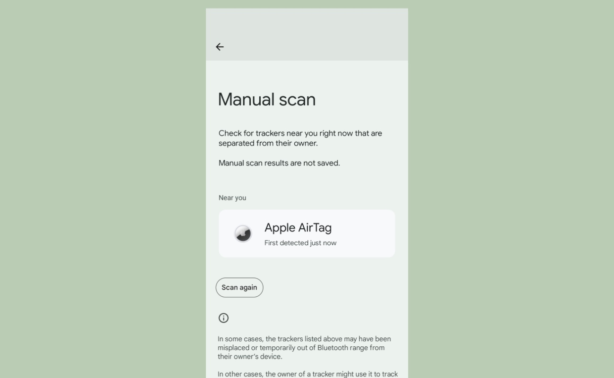
*ব্লুটুথ ট্র্যাকারের জন্য অ্যান্ড্রয়েডের "Manual Scan" স্ক্রিন।*

ট্র্যাকারের আইকনে ট্যাপ করুন। অজানা ট্র্যাকার স্বয়ংক্রিয়ভাবে শনাক্ত হলে যে স্ক্রিন আসে, আপনাকে সেই একই স্ক্রিনে নিয়ে যাওয়া হবে। এখানে "Play sound" করার বিকল্প আছে, যা AirTag খুঁজে পেতে সাহায্য করার জন্য বিপ শব্দ শুরু করবে। তবে আমরা দেখেছি এটি সবসময় নির্ভরযোগ্যভাবে কাজ করে না।

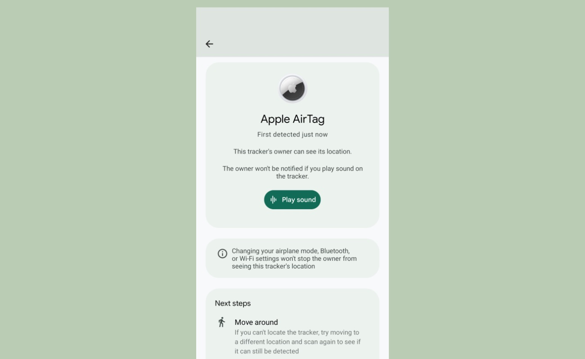
*অ্যান্ড্রয়েডে খুঁজে পাওয়া একটি AirTag দেখানোর স্ক্রিন।*

AirTag খুঁজে পাওয়ার পর এর সাদা পাশ আপনার ফোনের পেছনে ধরলে একটি ব্রাউজার উইন্ডো খুলবে, যেখানে সিরিয়াল নম্বর এবং মালিকের ফোন নম্বরের শেষ চার সংখ্যা দেখানো হবে। এটি কাজ করার জন্য কয়েক সেকেন্ড ফোনের কাছে ধরে রাখতে হতে পারে। AirTag-এর মালিক কে তা এখনও জানতে না পারলে তথ্যটি সংরক্ষণ করতে একটি স্ক্রিনশট নিন এবং নিচের [অজানা ট্র্যাকার পেলে কী করবেন](#অজানা-ট্র্যাকার-পেলে-কী-করবেন) অংশে যান। মনে রাখবেন, এটি একটি বার্নার ফোন বা দ্বিতীয় ফোন নম্বর হতে পারে। একইভাবে, কোনো AirTag-এর মালিক সেটির অবস্থান অন্যদের সঙ্গে শেয়ার করেছেন কি না, এই স্ক্রিনে তার কোনো ইঙ্গিত দেখানো হবে না।

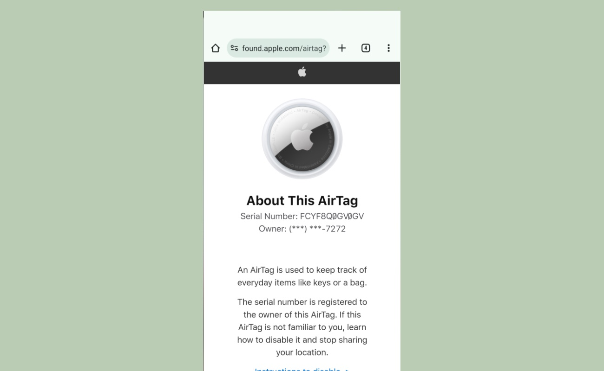
*AirTag স্ক্যান করার পর মালিকের তথ্য দেখানো হচ্ছে, যার মধ্যে তাঁর অ্যাপল অ্যাকাউন্টে ব্যবহৃত ফোন নম্বরের শেষ চার সংখ্যা রয়েছে।*

#### AirGuard দিয়ে অন্যান্য ট্র্যাকার অনুসন্ধান

আপনার ফোনে অ্যান্ড্রয়েড ১৪-তে আপডেট করা না গেলে, অথবা শুধু AirTag নয় আরও বেশি কিছু খুঁজতে চাইলে, এখানেও আপনাকে [AirGuard](https://play.google.com/store/apps/details?id=de.seemoo.at_tracking_detection.release) ব্যবহার করতে হবে। অ্যাপটি আগে ডাউনলোড করে না থাকলে এবং অনুমতিগুলো চালু না করে থাকলে এখনই তা করুন। অ্যাপ কাজ করার জন্য প্রয়োজনীয় কয়েকটি অনুমতি দিতে বলা হবে: লোকেশন, কাছাকাছি ডিভাইস এবং নোটিফিকেশন। লোকেশনের অনুমতি দেওয়া নিয়ে আপনি চিন্তিত হলে, জেনে রাখুন লোকেশন ছাড়াও অ্যাপটি কাজ করতে পারে, তবে তখন অ্যাপ ট্র্যাকারটি কোথায় খুঁজে পেয়েছিল তার অবস্থানের ইতিহাস থাকবে না।

AirGuard খুলুন এবং স্ক্রিনের নিচে রাডার আইকনসহ "Scan" বোতামে ট্যাপ করুন। কিছুক্ষণের অ্যানিমেশনের পর অ্যাপ কাছাকাছি যেসব ব্লুটুথ ট্র্যাকার শনাক্ত করেছে সেগুলো আপনাকে দেখানো হবে। এই ধরনের ম্যানুয়াল স্ক্যান সবচেয়ে ভালো কাজ করে যখন আপনি অন্যদের কাছ থেকে দূরে কোথাও থাকেন, কারণ ফলাফলে আপনার নিজের কেনা ট্র্যাকার, অথবা কাছাকাছি থাকা অন্য কারও ট্র্যাকারও আসতে পারে। উদাহরণস্বরূপ, কোনো পার্কিং লট বা অ্যাপার্টমেন্ট ভবনে এই স্ক্যান শুরু করলে সম্ভবত অনেকগুলো ফলাফল আসবে, যার বেশিরভাগই আপনাকে ট্র্যাক করতে ব্যবহৃত হচ্ছে না।

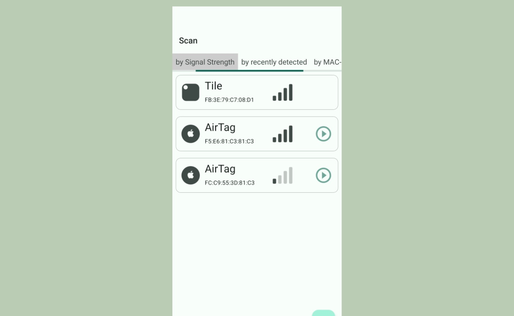
*অ্যান্ড্রয়েডে AirGuard-এর স্ক্যান স্ক্রিন, অনেকগুলো ফলাফল দেখাচ্ছে।*

আপনার অচেনা কোনো ট্র্যাকারে ট্যাপ করলে ট্র্যাকারটি সম্পর্কে আরও তথ্যসহ একটি স্ক্রিনে নিয়ে যাওয়া হবে।

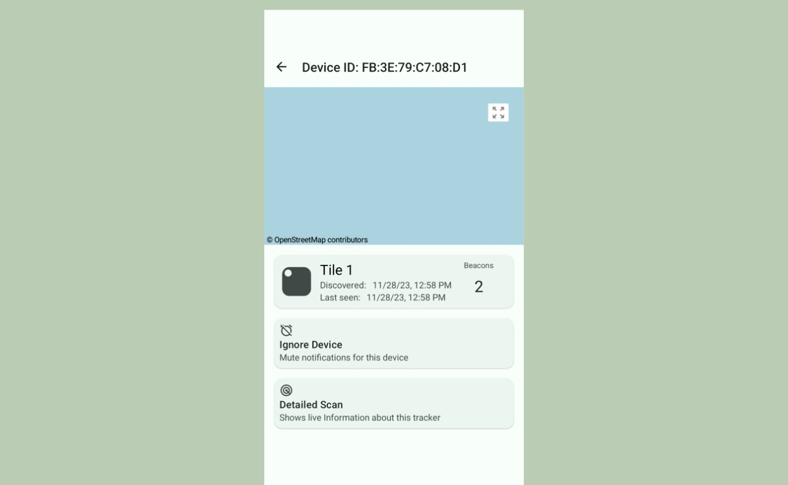
*অ্যান্ড্রয়েডে কোনো নির্দিষ্ট ট্র্যাকারে ট্যাপ করার পর AirGuard-এর ডিভাইস স্ক্রিন।*

AirTag-এর ক্ষেত্রে সেটি খুঁজে পেতে শব্দ বাজানোর বিকল্প দেওয়া হয়, তবে এটি খুব ভালো কাজ করে না এবং সবসময় শব্দ শুরু নাও হতে পারে। সেই বিকল্প না থাকলে বা কাজ না করলে রাডারের মতো অনুসন্ধান সুবিধা ব্যবহার করতে পারেন। "Detailed Scan" বোতামে ট্যাপ করুন, যেখানে সংকেতের শক্তি মাপার একটি মিটারসহ স্ক্রিন দেখতে পাবেন। হাঁটুন, এবং সংকেত শক্তিশালী হলে সেই দিকেই এগিয়ে যান। দুর্বল হলে অন্য দিকে চেষ্টা করুন।

সংখ্যাটি ৯০% বা তার বেশি হলে আপনি ট্র্যাকারের খুব কাছাকাছি আছেন। নিচের [অজানা ট্র্যাকার পেলে কী করবেন](#অজানা-ট্র্যাকার-পেলে-কী-করবেন) অংশে যান।

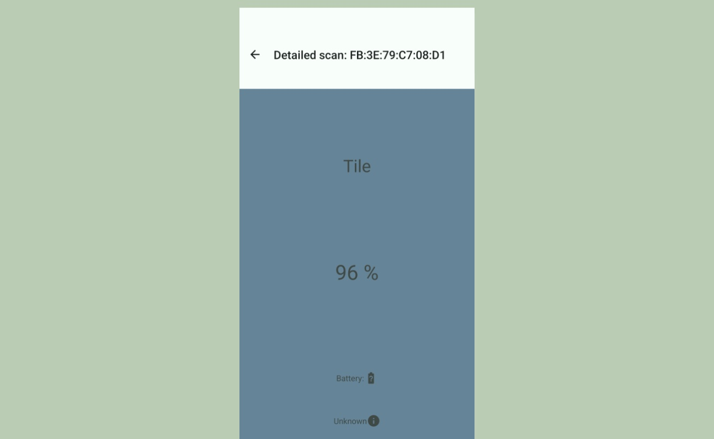
*অ্যান্ড্রয়েডে AirGuard-এর স্ক্যান স্ক্রিন।*

### আইফোনে ম্যানুয়াল অনুসন্ধান

AirGuard-এর মতো আলাদা অ্যাপ ডাউনলোড না করে আপনি আইফোন থেকে ম্যানুয়ালি AirTag খুঁজতে পারবেন না। AirGuard দিয়ে ব্লুটুথ ট্র্যাকার খোঁজা সহজ, যদিও Tile ও SmartTag খুঁজে পেতে আপনার সামনে বিকল্প AirTag-এর তুলনায় সীমিত।

[AirGuard](https://apps.apple.com/us/app/airguard-tracking-protection/id1659427454) আগে ডাউনলোড না করে থাকলে এখন ডাউনলোড করে খুলুন। অ্যাপ কাজ করার জন্য আপনাকে লোকেশন, নোটিফিকেশন এবং ব্লুটুথসহ বেশ কয়েকটি অনুমতি দিতে হবে।

নিচের মেনু বারে "Manual Scan" বোতামে ট্যাপ করুন।

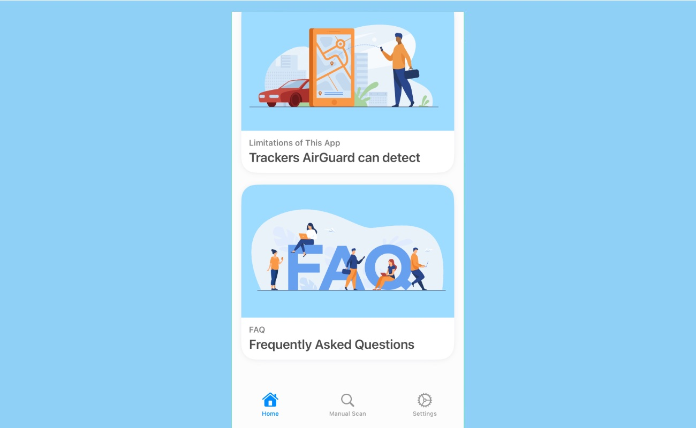
*আইফোনে AirGuard-এর হোম স্ক্রিন।*

পরবর্তী স্ক্রিনে অ্যাপ যেসব ট্র্যাকার শনাক্ত করেছে সেগুলো দেখানো হবে। এই ধরনের ম্যানুয়াল স্ক্যান সবচেয়ে ভালো কাজ করে যখন আপনি অন্যদের কাছ থেকে দূরে কোথাও থাকেন, কারণ ফলাফলে আপনার নিজের কেনা ট্র্যাকার, অথবা কাছাকাছি থাকা অন্য কারও বৈধ ট্র্যাকারও আসতে পারে। উদাহরণস্বরূপ, কোনো পার্কিং লট বা অ্যাপার্টমেন্ট ভবনে এই স্ক্যান শুরু করলে সম্ভবত অনেকগুলো ফলাফল আসবে, যার বেশিরভাগই আপনাকে ট্র্যাক করতে ব্যবহৃত হচ্ছে না।

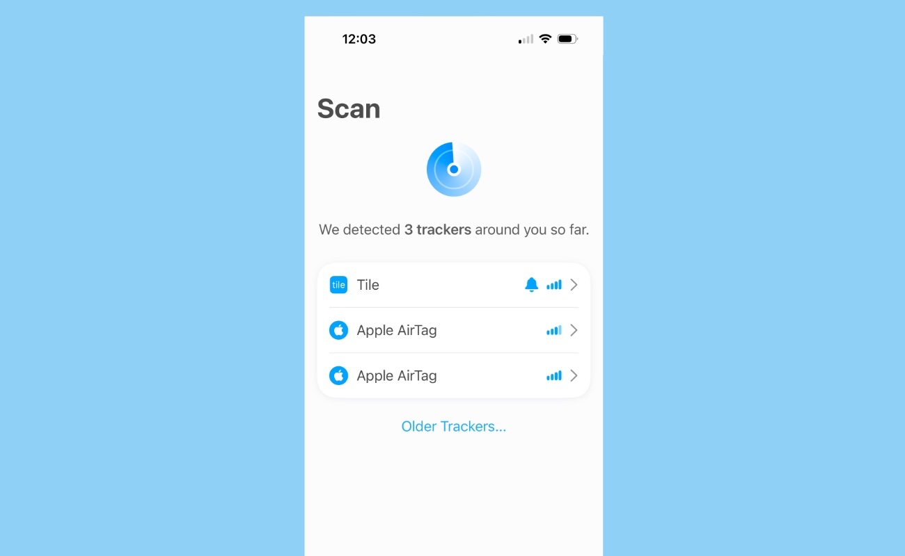
*আইফোনে AirGuard-এর "Scan" স্ক্রিন।*

কোনো অজানা ট্র্যাকার দেখতে পেলে ট্র্যাকারের নামে ট্যাপ করুন, তারপর পরবর্তী স্ক্রিনে "Locate Tracker"-এ ট্যাপ করুন। সংকেতের শক্তি মাপার একটি মিটারসহ স্ক্রিন দেখতে পাবেন।

হাঁটুন, এবং সংকেত শক্তিশালী হলে সেই দিকেই এগিয়ে যান। দুর্বল হলে অন্য দিকে চেষ্টা করুন। AirTag-এর মতো কিছু ট্র্যাকারে "Play Sound" বিকল্প থাকবে, যাতে ট্যাপ করলে ট্র্যাকারে স্পিকার থাকলে একটি শব্দ বাজবে। "Playback Failed" লেখা একটি সতর্কবার্তা পেলে তার অর্থ ট্র্যাকারটি এখনও মালিকের ফোনের সঙ্গে সংযুক্ত, অর্থাৎ মালিক কাছাকাছি আছেন। এটিও সম্ভব যে কেউ AirTag-এর স্পিকার শারীরিকভাবে নষ্ট করে অকেজো করে দিয়েছে, ফলে সংকেত শক্তিশালী হতে থাকলেও আপনি কোনো শব্দ শুনতে পাবেন না।

এর কয়েকটি ভিন্ন অর্থ হতে পারে: এটি হয়তো কাছাকাছি থাকা কোনো অপরিচিত ব্যক্তির AirTag, যিনি আপনাকে ট্র্যাক করছেন না। অথবা এর অর্থ হতে পারে, AirTag-টি মালিকের কাছ থেকে এখনও যথেষ্ট সময় বিচ্ছিন্ন হয়নি যে সেটিকে "অজানা" হিসেবে চিহ্নিত করা যায়। এজন্যই সম্ভব হলে এই পরীক্ষা অন্যদের থেকে অনেক দূরে করা গুরুত্বপূর্ণ। কোনো অজানা ট্র্যাকার খুঁজে পেলে নিচের [অজানা ট্র্যাকার পেলে কী করবেন](#অজানা-ট্র্যাকার-পেলে-কী-করবেন) অংশে যান।

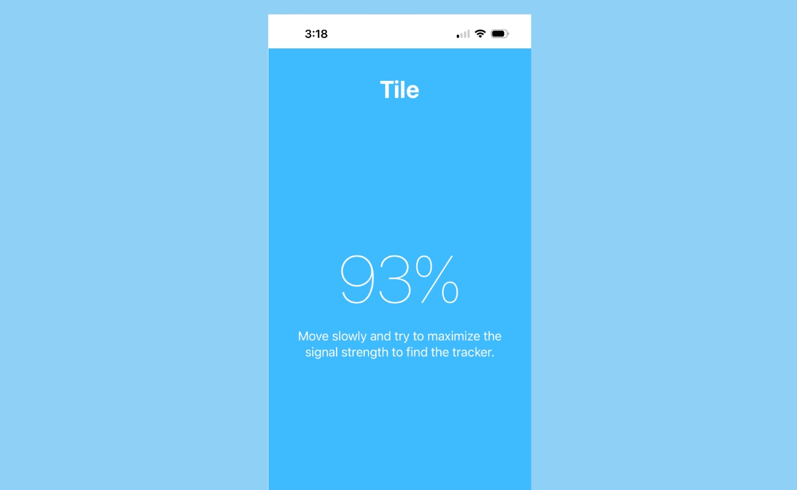
*আইফোনে AirGuard-এর অনুসন্ধান সুবিধা।*

## অজানা ট্র্যাকার পেলে কী করবেন

কোনো অজানা ব্লুটুথ ট্র্যাকার খুঁজে পেলে পরবর্তী পদক্ষেপগুলো সতর্কভাবে বিবেচনা করা গুরুত্বপূর্ণ। আপনার জন্য কোনটি সবচেয়ে ভালো হবে তা আপনার পরিস্থিতির ওপর নির্ভর করে, তবে মনে রাখার মতো কয়েকটি বিষয় এখানে দেওয়া হলো।

অন্য যেকোনো পদক্ষেপ নেওয়ার আগে একটি [নিরাপত্তা পরিকল্পনা (safety plan)](https://www.thehotline.org/plan-for-safety/create-your-personal-safety-plan/) তৈরি করা জরুরি। আপনি যদি কোনো নির্যাতনকারী ব্যক্তির সঙ্গে সম্পর্কে থাকেন, তাহলে সেই নির্যাতনকারীই হয়তো ডিভাইসটির মালিক এবং আপনাকে ট্র্যাক করতে এটি ব্যবহার করছেন। আপনি ডিভাইসটি নিষ্ক্রিয় করে দিলে এবং নির্যাতনকারী আর আপনার অবস্থান ট্র্যাক করতে না পারলে, তিনি অন্য কোনো নির্যাতনমূলক সিদ্ধান্ত নিতে পারেন এবং আপনার জন্য আরও বিপজ্জনক আচরণে জড়িয়ে পড়তে পারেন। সেই নির্যাতনকারীকে আপনি যে তাঁর ট্র্যাকিংয়ের কথা জেনে ফেলেছেন তা জানানোর আগে, নিরাপদ উপায়ে সেটি করার জন্য একটি পরিকল্পনা তৈরি করুন। পারিবারিক সহিংসতার শিকার ব্যক্তিদের জন্য কাজ করেন এমন স্থানীয় একজন সহায়তাকারী (advocate) আপনাকে সেই পরিকল্পনা তৈরিতে সাহায্য করতে পারেন। আপনি যুক্তরাষ্ট্রে থাকলে [National Domestic Violence Hotline](https://www.thehotline.org/)-এ ১-৮০০-৭৯৯-৭২৩৩ নম্বরে ফোন করে, অথবা ৮৮৭৮৮ নম্বরে "Start" লিখে টেক্সট করে স্থানীয় সহায়তাকারী খুঁজে পেতে পারেন।

> ট্র্যাকারটি নিষ্ক্রিয় করা আপনার জন্য নিরাপদ বলে মনে করলে যেকোনো ট্র্যাকারের ব্যাটারি খুলে নিলেই সেটি নিষ্ক্রিয় হয়ে যায়। AirTag-এর মতো কিছু ট্র্যাকার শনাক্ত হওয়ার পর অ্যাপেই দেখিয়ে দেয় কীভাবে সেটি নিষ্ক্রিয় করতে হয়। Samsung ও Tile-এর তৈরি ট্র্যাকারের মতো অন্যগুলোর ব্যাটারি খুলতে পেপারক্লিপের মতো বিশেষ কোনো সরঞ্জাম লাগতে পারে। এভাবে কোনো ব্লুটুথ ট্র্যাকার নিষ্ক্রিয় করলে যে ব্যক্তি সেটি রেখেছিলেন তিনি সতর্ক হয়ে যাবেন এবং সম্ভবত ধরে নেবেন যে আপনি সেটি খুঁজে পেয়েছেন।

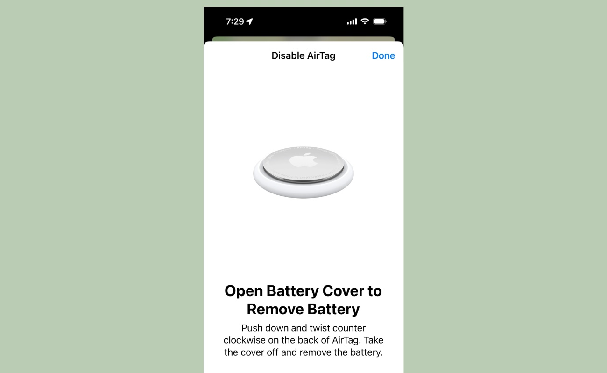
*আইফোনে AirTag নিষ্ক্রিয় করার নির্দেশনা।*

ব্লুটুথ ট্র্যাকারটি খুঁজে পাওয়ার পর কখনও কখনও এর মালিক সম্পর্কে অতিরিক্ত তথ্য জানা যেতে পারে, তবে কেবল AirTag-ই উল্লেখযোগ্য পরিমাণ তথ্য দেয়। AirTag আপনার ফোনের পেছনে ধরলে আপনাকে এমন একটি ওয়েবসাইটে নিয়ে যাওয়া হবে যেখানে সিরিয়াল নম্বর এবং মালিকের ফোন নম্বরের শেষ চার সংখ্যা দেখানো হয়। Tile, Samsung SmartTag এবং Chipolo-তে অনুরূপ কোনো সুবিধা নেই, যদিও কিছু Chipolo মডেল অ্যাপলের "Find My" অ্যাপের সঙ্গে কাজ করে এবং AirTag-এর মতোই তথ্য দেখাতে পারে।

আপনার নিরাপত্তা ঝুঁকিতে আছে বলে মনে হলে ট্র্যাকারটির বিষয়ে কোনো পদক্ষেপ নেওয়ার আগে আইনশৃঙ্খলা রক্ষাকারী বাহিনীর সঙ্গে অথবা কোনো বিশ্বস্ত বন্ধুর সঙ্গে যোগাযোগ করা আপনার জন্য ভালো হতে পারে। আপনি ট্র্যাকারটি নিষ্ক্রিয় করলে মালিক যে বুঝে ফেলবেন আপনি সেটি খুঁজে পেয়েছেন, তার সম্ভাবনা খুব বেশি। ব্লুটুথ ট্র্যাকারের নির্মাতা প্রতিষ্ঠান অনুযায়ী, আইনশৃঙ্খলা রক্ষাকারী বাহিনী কখনও কখনও প্রস্তুতকারকের কাছ থেকে তথ্য চেয়ে নিতে পারে। আপনি যে তথ্যই খুঁজে পান তার স্ক্রিনশট নিয়ে রাখুন, এবং সিরিয়াল নম্বর পাওয়া গেলে অবশ্যই সেটি অন্তর্ভুক্ত করুন।
